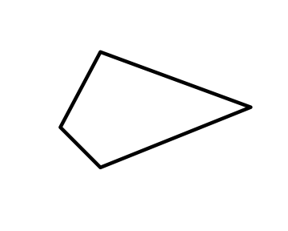
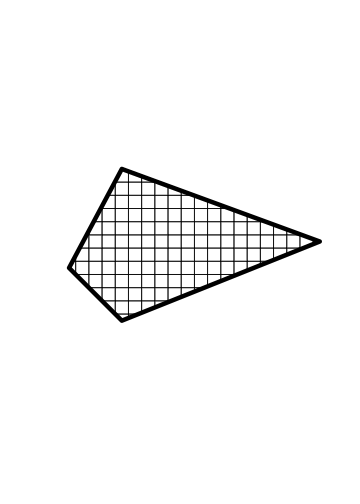
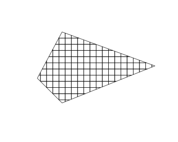
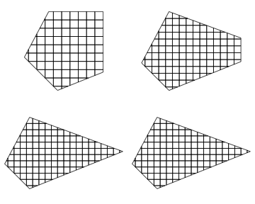
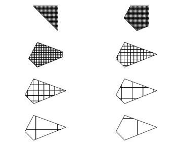

geoaxe
======


[](https://travis-ci.org/ropenscilabs/geoaxe)

`geoaxe` - split geospatial objects into pieces

## Install


```r
devtools::install_github("ropenscilabs/geoaxe")
```


```r
library("geoaxe")
library("sp")
```

## Spatial Polygons and friends input

Works for only `SpatialPolygons` for now, but aim to include related classes soon.


```r
library("rgeos")
wkt <- "POLYGON((-180 -20, -140 55, 10 0, -140 -60, -180 -20))"
poly <- rgeos::readWKT(wkt)
polys <- chop(x = poly)
```

Plot original polygon


```r
plot(poly, lwd = 6)
```



Add chopped up polygon bits


```r
plot(polys, add = TRUE)
```




## Well-Known Text input


```r
wkt <- "POLYGON((-180 -20, -140 55, 10 0, -140 -60, -180 -20))"
plot(chop(wkt))
```




## Manipulate number of cells

> plots go left to right, then down, and repeat


```r
layout(matrix(c(1,2,3,4), 2, 2, byrow = TRUE))
par(mar = c(1, 0, 1, 0))
plot(chop(wkt, n = 10))
plot(chop(wkt, n = 15))
plot(chop(wkt, n = 20))
plot(chop(wkt, n = 50))
```




## Manipulate cell size

> plots go left to right, then down, and repeat


```r
layout(matrix(1:8, 4, 2, byrow = TRUE))
par(mar = c(1, 0, 1, 0))
plot(chop(wkt, size = 2))
plot(chop(wkt, size = 4))
plot(chop(wkt, size = 8))
plot(chop(wkt, size = 15))
plot(chop(wkt, size = 25))
plot(chop(wkt, size = 50))
plot(chop(wkt, size = 100))
plot(chop(wkt, size = 200))
```




## Meta

* Please [report any issues or bugs](https://github.com/ropenscilabs/geoaxe/issues).
* License: MIT
