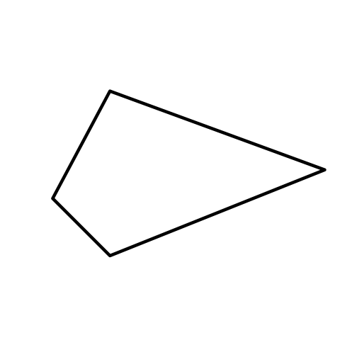
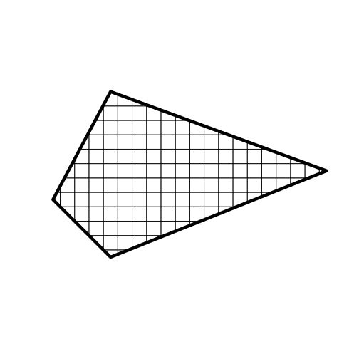
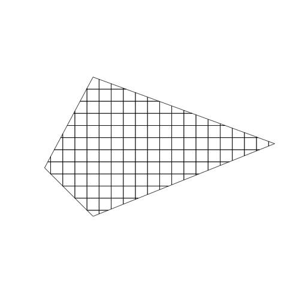
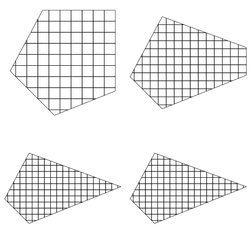
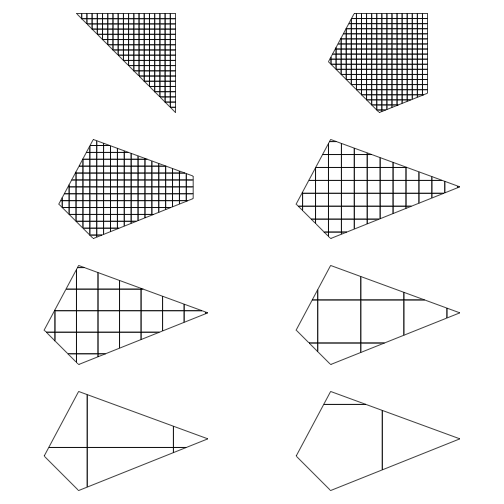

<!--
%\VignetteEngine{knitr::knitr}
%\VignetteIndexEntry{geoaxe introduction}
%\VignetteEncoding{UTF-8}
-->


geoaxe introduction
======

`geoaxe` helps you split geospatial objects into pieces. It includes support for 
spatial object inputs (e.g., `SpatialPolygons`), Well-Known Text (WKT), and GeoJSON 
(character and list).

__But, Why?__

The use case we have at rOpenSci is that often web APIs accept WKT, but the WKT string
can only be so long. If the string is longer than allowed by a web API, then one option
is to split up the WKT string into many, and do a request on each one of those.

Surely there are other use cases for splitting up geospatial objects :)

## Installation

Install from CRAN


```r
install.packages("geoaxe")
```

Or install the development version from GitHub


```r
devtools::install_github("ropenscilabs/geoaxe")
```

Load `geoaxe` (as well as `sp` and `rgeos`)


```r
library("geoaxe")
library("sp")
library("rgeos")
```

## Spatial Polygons and friends input

Works for `SpatialPolygons` and `SpatialPolygonsDataFrame` for now, may include other classes later


```r
wkt <- "POLYGON((-180 -20, -140 55, 10 0, -140 -60, -180 -20))"
poly <- rgeos::readWKT(wkt)
polys <- chop(x = poly)
```

Plot original polygon


```r
plot(poly, lwd = 6)
```



Add chopped up polygon bits


```r
plot(polys, add = TRUE)
```




## Well-Known Text input


```r
wkt <- "POLYGON((-180 -20, -140 55, 10 0, -140 -60, -180 -20))"
plot(chop(wkt))
```




## Manipulate number of cells

> plots go left to right, then down, and repeat


```r
layout(matrix(c(1,2,3,4), 2, 2, byrow = TRUE))
par(mar = c(1, 0, 1, 0))
plot(chop(wkt, n = 10))
plot(chop(wkt, n = 15))
plot(chop(wkt, n = 20))
plot(chop(wkt, n = 50))
```




## Manipulate cell size

> plots go left to right, then down, and repeat


```r
layout(matrix(1:8, 4, 2, byrow = TRUE))
par(mar = c(1, 0, 1, 0))
plot(chop(wkt, size = 2))
plot(chop(wkt, size = 4))
plot(chop(wkt, size = 8))
plot(chop(wkt, size = 15))
plot(chop(wkt, size = 25))
plot(chop(wkt, size = 50))
plot(chop(wkt, size = 100))
plot(chop(wkt, size = 200))
```




